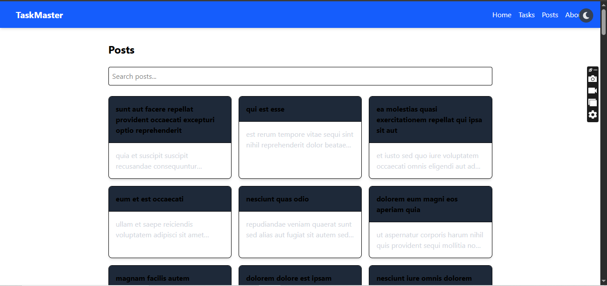
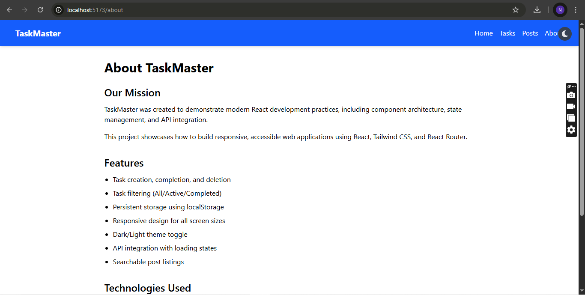
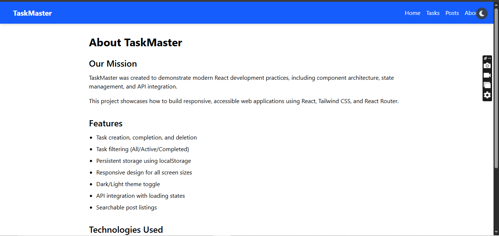

live URL : https://task-manager-lxeq.vercel.app/

# 📝 DevTasks – React Task Manager App

### TASKMASTERS







A responsive and interactive task manager app built using **React.js**, **Vite**, **Tailwind CSS**, and **React Router**. This project demonstrates mastery of front-end development concepts such as **component architecture**, **state management with hooks**, **custom hooks**, **API integration**, and **dark/light theming**.

---


## 📁 Project Structure

```
src/
├── components/     # Reusable UI components (Button, Card, Navbar, etc.)
├── pages/          # App pages (Home, Tasks, API Page)
├── utils/          # Custom hooks like useLocalStorage
└── App.jsx         # App entry with routing
```

---

## ✅ Features

- 🔄 Add, complete, delete, and filter tasks
- 🎨 Theme toggle (light/dark mode)
- 🧱 Reusable components using props
- 📦 Custom `useLocalStorage` hook for data persistence
- 🌐 API integration with loading/error states
- 📱 Fully responsive for mobile, tablet, and desktop
- ⚙️ Smooth animations and transitions with Tailwind

---

## 🔧 Technologies Used

- [React.js](https://react.dev/)
- [Vite](https://vitejs.dev/)
- [Tailwind CSS](https://tailwindcss.com/)
- [React Router](https://reactrouter.com/)
- [JSONPlaceholder API](https://jsonplaceholder.typicode.com/)

---

## 🛠️ Getting Started

### Prerequisites

- Node.js v18+ installed
- npm or pnpm

### Installation

```bash
# Clone your GitHub Classroom repository
git clone https://github.com/your-username/devtasks.git
cd devtasks

# Install dependencies
npm install

# Start the development server
npm run dev
```

---

## 🧪 Screenshots

### 🔆 Light Mode




---

## 📌 Tasks Completed

- [x] Project Setup with Vite + Tailwind CSS
- [x] Component architecture (Button, Card, Navbar, Footer, Layout)
- [x] TaskManager component with all CRUD & filter functionality
- [x] React hooks: useState, useEffect, useContext, custom hook
- [x] Fetched posts from JSONPlaceholder API
- [x] Displayed data with loading, error, search & pagination
- [x] Deployed to Vercel/Netlify with README + screenshots

---


## 👨‍🏫 Submission Guidelines

- ✅ Committed and pushed code regularly
- ✅ Proper file and folder structure
- ✅ Included all screenshots
- ✅ Added live URL in the README
- ✅ Met all autograder requirements

---

## ©️ License

This project is part of a coursework assignment and follows academic integrity guidelines.
